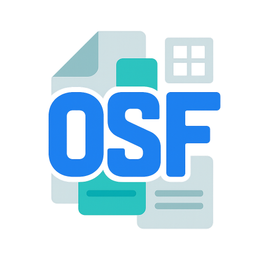
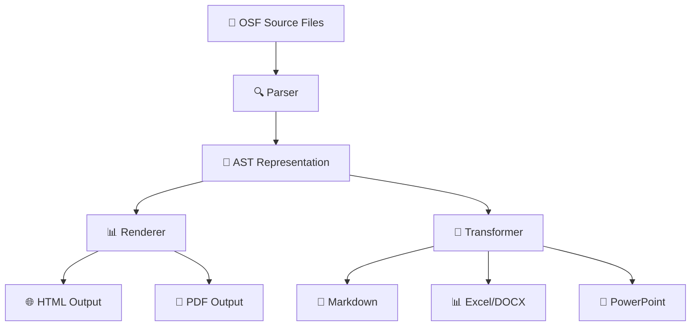

# OmniScript Core

<div align="center">



# OmniScript Format (OSF)

**🚀 The Universal Document DSL for LLMs, Agentic AI, and Git-Native Workflows**

[](https://opensource.org/licenses/MIT)
[](https://badge.fury.io/js/omniscript-cli)
[](https://www.npmjs.com/package/omniscript-cli)
[](https://github.com/OmniScriptOSF/omniscript-core)

[](https://github.com/OmniScriptOSF/omniscript-core/actions)
[](https://codecov.io/gh/OmniScriptOSF/omniscript-core)
[](https://www.typescriptlang.org/)
[](https://nodejs.org/)

[📖 Documentation](docs/spec-v0.5-overview.md) • [🚀 Quick Start](#-quick-start) • [💡 Examples](examples/) • [🤝 Contributing](CONTRIBUTING.md) • [💬 Discussions](https://github.com/OmniScriptOSF/omniscript-core/discussions)

</div>

---

## ✨ What is OmniScript Format?

OmniScript Format (OSF) revolutionizes document creation by unifying the best features of multiple formats into a single, AI-friendly syntax:

<table>
<tr>
<td width="33%">

### 📝 **Rich Documents**
Like Markdown & LaTeX
- Expressive prose & math
- Structured content
- Beautiful typography

</td>
<td width="33%">

### 🎯 **Dynamic Presentations**
Like PowerPoint & Keynote
- Rich layouts & themes
- Smooth transitions
- Interactive elements

</td>
<td width="33%">

### 📊 **Live Spreadsheets**
Like Excel & Google Sheets
- Data tables & formulas
- Real-time calculations
- Dynamic charts

</td>
</tr>
</table>

> **🎯 Current Version:** `v0.5.4` | **🔥 Status:** Active Development | **📅 Next Release:** v1.0.0

---

## 🌟 Why Choose OmniScript?

<div align="center">

| Feature | Traditional Formats | OmniScript Format |
|---------|-------------------|------------------|
| **🔄 Version Control** | Binary, merge conflicts | ✅ Git-native, meaningful diffs |
| **🤖 AI Integration** | Complex parsing | ✅ LLM-friendly syntax |
| **📱 Multi-format Output** | Single format only | ✅ Export to DOCX, PPTX, XLSX, MD |
| **🔗 Interoperability** | Format silos | ✅ Unified document ecosystem |
| **⚡ Live Formulas** | Static content | ✅ Dynamic calculations |
| **🎨 Rich Styling** | Limited or complex | ✅ Intuitive theme system |

</div>

---

## 🚀 Quick Start

### 📦 Installation

<table>
<tr>
<td width="50%">

**Global CLI Installation**
```bash
npm install -g omniscript-cli
# or
pnpm add -g omniscript-cli
```

</td>
<td width="50%">

**Library Integration**
```bash
npm install omniscript-parser
# or
pnpm add omniscript-parser
```

</td>
</tr>
</table>

### ⚡ Quick Commands

```bash
# Parse and validate OSF files
osf parse examples/rich_demo.osf

# Render to beautiful HTML
osf render examples/rich_demo.osf --format html

# Export to other formats
osf export examples/rich_demo.osf --target md

# Format for consistency
osf format examples/rich_demo.osf
```

---

## 💡 Example in Action

<details>
<summary><b>🎯 Click to see a complete OSF example</b></summary>

```osf
@meta {
  title   : "Q2 Business Review";
  author  : "Alphin Tom";
  date    : "2025-06-07";
  theme   : "CorporateBlue";
}

@doc {
  # Executive Summary
  
  Our Q2 performance exceeded expectations with **15% revenue growth** 
  and significant improvements in customer retention.
  
  ## Key Metrics
  - Revenue: $2.3M (+15%)
  - Customer Churn: 3% (-2%)
  - Team Size: 45 (+8 new hires)
}

@slide {
  title : "Q2 Highlights";
  layout : TitleAndBullets;
  transition : FadeIn;
  bullets {
    "💰 Revenue grew 15% to $2.3M";
    "👥 Customer churn decreased to 3%";
    "🚀 Launched 3 major features";
    "🌟 Team expanded by 8 members";
  }
}

@sheet {
  name : "Regional Performance";
  cols : [Region, Q1_Revenue, Q2_Revenue, Growth_Percent];
  data {
    (2,1)="North America"; (2,2)=850000; (2,3)=975000;
    (3,1)="Europe"; (3,2)=650000; (3,3)=748000;
    (4,1)="Asia Pacific"; (4,2)=400000; (4,3)=477000;
  }
  formula (2,4): "=(C2-B2)/B2*100";
  formula (3,4): "=(C3-B3)/B3*100";
  formula (4,4): "=(C4-B4)/B4*100";
}
```

</details>

---

## 📦 Package Ecosystem

<div align="center">

### Core Packages

[](https://www.npmjs.com/package/omniscript-parser)
[](https://www.npmjs.com/package/omniscript-cli)

</div>

| Package | Description | Version | Downloads |
|---------|-------------|---------|-----------|
| **[omniscript-parser](https://www.npmjs.com/package/omniscript-parser)** | Core parsing library with TypeScript support |  |  |
| **[omniscript-cli](https://www.npmjs.com/package/omniscript-cli)** | Command-line tools with `osf` binary |  |  |

---

## 🏗️ Project Architecture

<div align="center">




</div>

### 📂 Repository Structure

```
omniscript-core/
├── 📋 spec/               # Versioned specifications
│   ├── v0.5/             # Current stable spec
│   ├── v1.0/             # Next major version
│   └── roadmap.md        # Development roadmap
├── 🔍 parser/            # Core parsing engine
├── ⚡ cli/               # Command-line interface
├── 📚 examples/          # Sample OSF documents
├── 🧪 tests/             # Comprehensive test suite
├── 📖 docs/              # Architecture & design docs
└── 🔧 scripts/           # Development & release tools
```

---

## 🛠️ Development

### Prerequisites


### Setup

```bash
# Clone the repository
git clone https://github.com/OmniScriptOSF/omniscript-core.git
cd omniscript-core

# Install dependencies
pnpm install

# Build all packages
pnpm run build

# Run tests
pnpm test

# Start development
pnpm run dev
```

### 🚀 Release Process

<details>
<summary><b>📋 For Maintainers</b></summary>

```bash
# Patch release (0.5.4 → 0.5.5)
pnpm run release:patch

# Minor release (0.5.4 → 0.6.0)
pnpm run release:minor

# Major release (0.5.4 → 1.0.0)
pnpm run release:major
```

Our automated release process:
- ✅ Runs comprehensive tests
- ✅ Updates package versions
- ✅ Creates GitHub releases
- ✅ Publishes to npm
- ✅ Updates documentation

</details>

---

## 🎯 Roadmap

<div align="center">

### 🗓️ Version Timeline

| Version | Status | Features | ETA |
|---------|--------|----------|-----|
| **v0.5** | ✅ **Current** | Core parsing, CLI tools, basic rendering | Released |
| **v1.0** | 🚧 **In Progress** | Advanced exports, diagram support | Q2 2025 |
| **v1.1** | 📋 **Planned** | Real-time collaboration, plugins | Q3 2025 |
| **v2.0** | 💭 **Future** | Visual editor, cloud integration | 2026 |

</div>

### 🔥 Coming Soon

- 🎨 **Visual Editor** - WYSIWYG editing experience
- 📊 **Advanced Charts** - Interactive data visualizations  
- 🔗 **Real-time Collaboration** - Multi-user editing
- 🧩 **Plugin System** - Extensible functionality
- ☁️ **Cloud Integration** - Seamless sync across devices

---

## 🤝 Contributing

<div align="center">

**We ❤️ contributions from the community!**

[](https://github.com/OmniScriptOSF/omniscript-core/graphs/contributors)
[](http://makeapullrequest.com)
[](https://www.firsttimersonly.com/)

</div>

### 🌟 Ways to Contribute

- 🐛 **Report bugs** via [GitHub Issues](https://github.com/OmniScriptOSF/omniscript-core/issues)
- 💡 **Suggest features** in [Discussions](https://github.com/OmniScriptOSF/omniscript-core/discussions)
- 📖 **Improve documentation** 
- 🔧 **Submit pull requests**
- ⭐ **Star the repository**

### 📋 Quick Links

- [📖 Contributing Guide](CONTRIBUTING.md)
- [🤝 Code of Conduct](CODE_OF_CONDUCT.md)
- [🐛 Bug Reports](https://github.com/OmniScriptOSF/omniscript-core/issues/new?template=bug_report.md)
- [💡 Feature Requests](https://github.com/OmniScriptOSF/omniscript-core/issues/new?template=feature_request.md)

---

## 📊 Project Stats

<div align="center">


</div>

---

## 📄 License

<div align="center">

**MIT License** © 2025 [Alphin Tom](https://github.com/alpha912)

[](https://opensource.org/licenses/MIT)

*This project is free and open-source software. We believe in the power of community-driven development.*

</div>

---

## 🌐 Connect With Us

<div align="center">

[](https://github.com/OmniScriptOSF)
[](https://github.com/OmniScriptOSF/omniscript-core/discussions)
[](https://twitter.com/OmniScriptOSF)
[](https://discord.gg/omniscript)

**Maintainer:** [Alphin Tom](https://github.com/alpha912) | **Organization:** [OmniScriptOSF](https://github.com/OmniScriptOSF)

</div>

---

<div align="center">


### 🚀 Ready to revolutionize your document workflow?

**[Get Started Now](docs/spec-v0.5-overview.md)** • **[View Examples](examples/)** • **[Join Community](https://github.com/OmniScriptOSF/omniscript-core/discussions)**

---

*Made with ❤️ by the OmniScript community*

</div>
